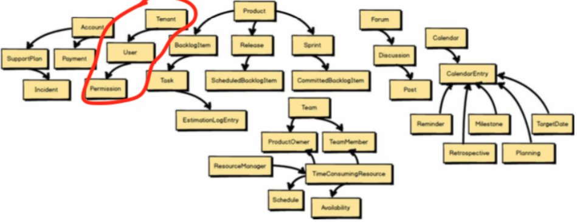
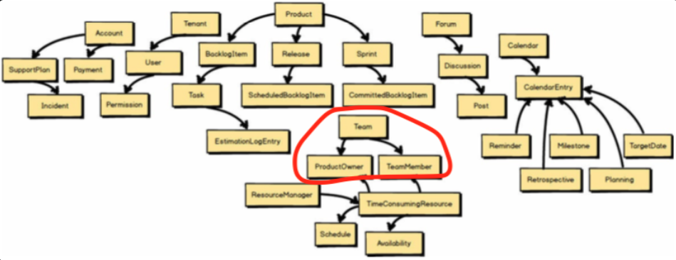
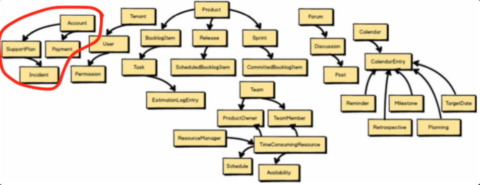
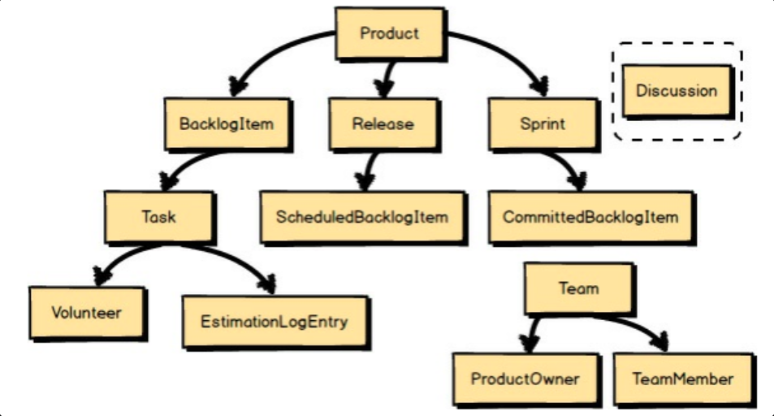
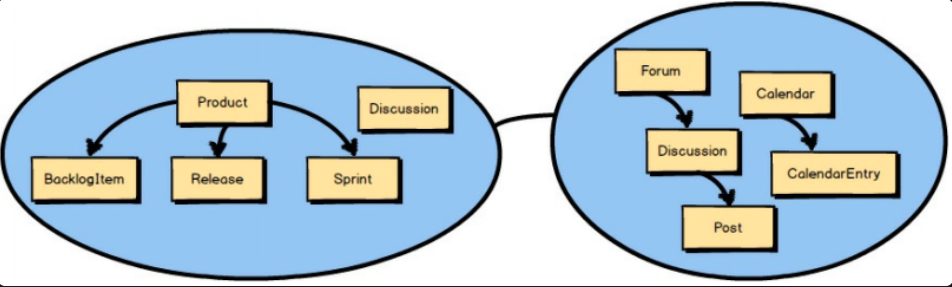
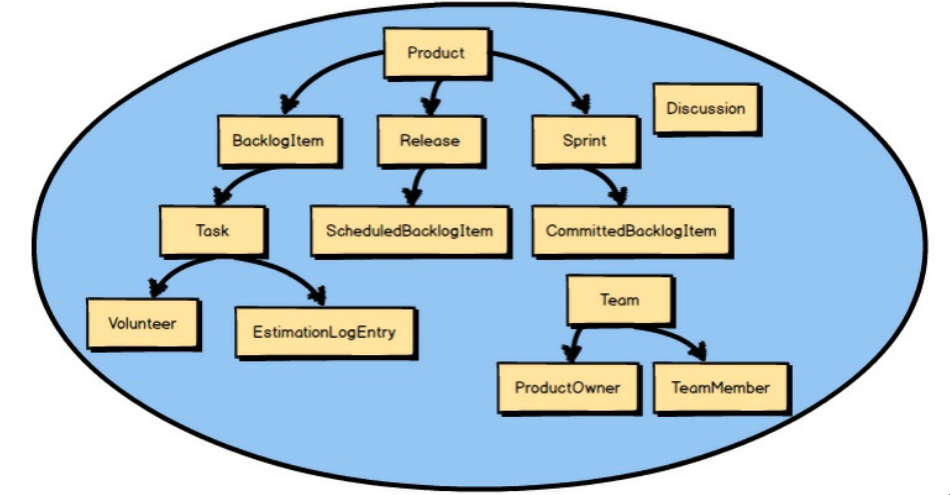
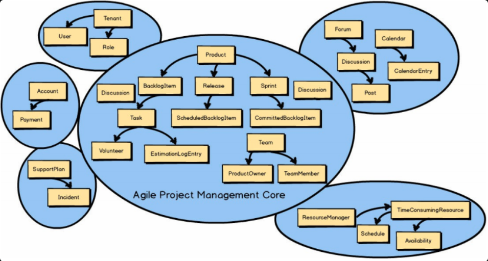

## DDD 를 배워야 하는 이유
코드의 변경이 곧 모델의 변경이라는 점을 개발자가 인식하지 못한다면 리팩터링은 모델을 강화시키기보단 약화시킬것이다. 
모델러가 구현 프로세스와 분리되어있을경우, 모델러는 구현상의 제약조건을 감안하는 능력을 갖추지 못할 것이다.
모델 드리븐 디자인에서는 코드가 즉 모델이라고 볼수있다.
즉 코드를 변경하는 것이 모델을 변경하는 것이고 프로그래머가 즉 모델러다.

세부사항의 설계는 대부분 구현상에서 존재하게 되니까 우리가 모델링을 안한다고 해서 몰라도 된다는 지나친 억측일수도 있다

## 바운디드 컨텍스트란
1. 바운디드 컨텍스트는 의미적으로 동일한 컨텍스트의 범위를 표현한다.
	1. 이것은 그 범주 내에서 소프트웨어 모델의 각 컴포넌트는 특정한 의미를 갖고, 특정한 일을 수행한다는 의미다.
	2. 바운디드 컨텍스트 내에 존재하는 컴포넌트들은 컨텍스트에 특화돼 있으며, 컨텍스트 안에서 의미가 살아난다.

모델링 시작 처음 단계에서는 바운디드 컨텍스트가  `문제영역` 의 일부라고 생각 할 수 있지만 
모델이 더 깊은 의미와 명확성을 받아들이게 되면서 *바운디드 컨텍스트* 는 빠르게 `해결영역` 으로 전환되고, 소스 코드로 반영되기 시작 할 것이다.

즉, 바운디드 컨텍스트는 모델이 구현되는 곳이고 ,바운디드 컨텍스트 마다 각각 분리된 소프트웨어 산출물이 나온다.

>[!tip] 문제영역과 해결영역
>
>문제 영역은 상위 수준의 전략적 분석을 수행하고 , 주어진 프로젝트 제약사항 내에서 단계를 설계하는 곳이다.
> 상위 수준의 프로젝트 요인에 대해 논의하고, 주요 목표와 위험 사항에 대해 이야기하면서 간단한 다이어그램을 사용할 수 도 있다.
> 실제로 컨텍스트 맵은 문제 영역에서 매우 잘 활용된다.
> 
> 해결 영역은 문제 영역의 논의가 핵심 도메인으로 바라보는 해결 방안을 구현하는 곳이다.
> 바운디드 컨텍스트를 조직의 핵심 전략 계획의로 개발하고 있을 때, 이를 '핵심 도메인' 이라고 한다.

도메인 모델 = 문제 영역

도메인 모델 안(문제 영역) 에서 여러 제약사항이 있고

Bounded Context 로 범위의 제한을 줘서 무결성을 보장해준다

## 좋은 방향의 바운디드 컨텍스트 범위

좋은 방향의 컨텍스트 범위는 모델의 무결성을 유지할 수 있는 최소 단위이다.
이 경계내에서는 모델이 일관성을 유지할수 있는 범위이고 바운디드 컨텍스트는 외부의 이슈에 대응할 필요가 없다.
외부와의 연결이 모델의 무결성을 침해해서는 안된다.
하지만 무조건은 아니고 어떨때는 이러한 전략을 포기하고 비용과 리소스가 절약이 될수 있다.

## 보편 언어란?
컨텍스트 범위 내의 소프트웨어 모델은 바운디드 컨텍스트 안에서 일하는 팀이 생성하고, 
그 안에서 기능하는 소프트웨어 모델을 만드는 모든 팀 구성원이 사용하는 언어를 반영한다. 
이 언어는 팀 구성원들이 이야기할 때 사용되고, 소프트웨어 모델 안에 구현되기 때문에 `보편언어`라고 부른다. 보편어는 엄격하고, 정확하고 ,엄중하며, 단호해야 한다.
하지만 소프트웨어 모델을 사용하는 팀원 뿐 만이 아니라 비개발자, 도메인 전문가 등 과 동일한 보편언어를 구성해서 번역에 드는 비용을 낮추는 것이 보편언어이다.
소프트웨어를 사용하는 팀원들끼리 X , 해당 도메인 업무에 들어가있는 모든 사람들 O

## DDD 관점에서 바운디드 컨텍스트

DDD는 서로 다른 개념들을 각기 다른 바운디드 컨텍스트 안으로 분리해 놓음으로써 개념간 차이를 더욱 중시한다.
즉, 각기 다른 언어와 그에 따른 기능이 존재하는 것을 인정하는 것이다.

예를 들어, '비행' 에 세가지 의미가 존재한다면 3개의 바운디드 컨텍스트가 있고, 각 컨텍스트 들은 그들만의 고유한 정책적 특성을 포함한 정책을 갖는다.

컨텍스트 안에 있어야지 비로소 모델의 개념적 완정성을 가진다 라는 말도 있다.

## 핵심 도메인이란?

바운디드 컨텍스트가 조직의 핵심 전략적 계획으로 개발되고 있을 때,이를 `핵심 도메인` 이라고 한다.

조직이 사용하는 모든 소프트웨어와 비교해볼 때, 핵심 도메인은 가치 있는 것들을 달성하는 수단이 되기 때문에 가장 중요한 소프트웨어 모델 중 하나다.
핵심 도메인은 다른 조직과의 경쟁에 대한 차별화를 위해 개발한다. 이 때문에 최소한 하나의 주요 사업 부문을 다룬다. 조직이 모든 것에 뛰어날 수는 없고,
또 그렇게 만들려고 해서도 안 된다. 기업의 올바른 전략적 결정을 위해 무엇이 핵심 도메인이어야 하고, 어떤것을 제외시켜야 하는지 현명하게 선택해야 한다.
이것이 DDD 의 주된 가치 제안이고, 핵심 도메인에 최적의 자원을 투여해서 적절하게 투자해야 한다.

## 컨텍스트 매핑이란  (추후 파일을 따로 빼서 다룰 예정)

애자일 프로젝트 관리 '핵심 도메인' 을 다른 바운디드 컨텍스트와 통합해야 한다는 것도 배웠는데, DDD 에서는 이런 통합을 '컨텍스트 매핑' 이라고 한다.
내가 이해한걸로는 '핵심 도메인' 은 프로젝트 에서 가장 주요한 바운디드 컨텍스트를 의미하는데 다른 바운디드 컨텍스트와 통합해야 하는 상황도 발생하는데 이것을 '컨텍스트 매핑' 이라고 한다.

>[!tip] 바운디드 컨텍스트, 팀 그리고 소스 코드 리파지토리
>각각의 바운디드 컨텍스트는 단일 팀에만 할당 돼야 하고, 각 바운디드 컨텍스트마다 독립적인 소스 코드 리파지토리가 있어야 한다.
>한 팀의 다수의 바운디드 컨텍스트에 대해 일을 할 수 있지미나, 다수의 팀이 하나의 바운디드 컨텍스트를 수행할 수는 없다.
>보편 언어를 나눈 거소가 같은 방법으로 바운디드 컨텍스트마다 소스 코드와 데이터베이스 스키마도 명확히 분리한다.
>메인 소스 코드와 함께 인수 테스트와 단위 테스트를 유지해야 한다.
>
>하나의 바운디드 컨텍스트를 한 팀이 수행한다는 것은 특히 중요한데, 이는 다른 팀이 소스 코드를 변경 할 때 반갑지 않은 문제가 발생할 가능성을 완전히 제거할 수 있기 때문이다.
>각 팀은 각자의 소스 코드와 데이터베이스를 소유하고, 공식 인터페이스를 정의해서 바운디드 컨텍스트를 다른 팀이 사용할 수 있게 허용한다.
>
>이것이 DDD 사용의 이점이다.

## 문제상황 으로 보는 바운디드 컨텍스트가 필요한 이유 1

각자 팀들은 각자의 도메인 모델을 작고 관리할 수 있는 정도에서 시작했다 해도 점점 더 많은 개념이 쌓이는 것을 언제 멈춰야 하는지 모를때가 자주 있을것이다.
하지만 각 팀들은 더 많은 개념을 계속 추가한다. 이는 나중에 커다란 문제로 발전한다.
하나의 거대하고, 혼란스럽고, 경계가 제한되지 않은 모델 안에 너무 많은 개념이 존재하는 것은 물론, 실제로 다수의 언어가 혼재되면서 점차 모델 내의 언어가 모호 해지기 시작한다.

이런 문제가 때문에 새로운 소프트웨어 제품을 큰 `진흙 덩어리` 처럼 만드는 상황이 종종 발생한다.
이 덩어리는 시스템의 명확한 경계 없이 여러 개의 뒤엉킨 모델들을 담고 있는 것으로,
`다수의 팀이 이 모델을 활용해 일을 하게 된다면 아주 큰 문제`가 될수 있다. 

이 뿐만 아니라 서로 관련이 없는 다양한 개념들이 수많은 모듈로 확정되거나 어울리지 않는 모듈을 상호 연계시킬 수도 있다.

이런 상황에서는 프로젝트에서 테스트를 수행하는데 아주 오랜 시간이 걸릴 것이고, 
이로 인해 중요한 시점에 이 테스트를 건너뛰어야만 하는 상황이 나타날 수 도 있다.

## 문제상황 으로 보는 바운디드 컨텍스트가 필요한 이유 2
문제 상황 :
제품을 만드는 회사가 있고, 핵심도메인을 'Product' 로 모델링을 완료한 상황
회의 때 내부에서 User 도 추가해야 하고 , 달력 기능, 장소 기능, 등 추가를 하였다.
결국, 회의 시작과 동시에 '진흙 덩어리' 로 인도하는 상황이다.

문제 발생 이유 : 
이미 정의한 모델링 요소들과 관련돼, 빨리 머리에 떠올리수 있는 두세 개 이상의 개념을 생각하는 것은 그리 어렵지 않기 때문이다.

문제를 피하는데 도움을 줄 수 있는 2가지 전략적 설계 방법 :
1. 바운디드 컨텍스트
2. 보편언어

바운디드 컨텍스트를 사용하는것은 "핵심이 무엇인가?" 라는 질문에 답하도록 유도한다.
바운디드 컨텍스트는 전략적 계획의 핵심이 되는 모든 개념들을 밀접하게 유지하면서 포용해야 하고, 나머지는 모두 제외시켜야 한다.

바운디드 컨텍스트에 남은 개념들은 팀이 사용하는 보편언어의 일부가 된다.

추가로, 컨텍스트 매핑을 이용하여 모델링을 어떤 전략을 가져갈지 도움을 줄 수 있는것이 DDD 의 공부 이유이다.

>[!tip] 기본적인 설계를 하려면
>2개의 기본적인 설계 도구가 있는데
>하나는 `바운디드 컨텍스트` 이고 또 다른 하나는 `보편 언어` 이다.
>위에 언급 했듯이  "핵심이 무엇인가?" 라는 질문에 답하도록 유도해야 하고, 바운디드 컨텍스트에 남은 개념들은 팀이 사용하는 보편언어의 일부가 된다.

>[!info] 꼭 인지해야 할 정보
>엄격하게 핵심만 걸러낸 후 살아남은 개념들은 해당 바운디드 컨텍스트를 소유하는 팀의 `보편언어`가 된다.
>경계는 그 안의 엄격함을 강조한다.

---

## 도메인 전문가는 누구?

도메인 전문가는 다양한 비즈니스 영역들마다 존재한다.
이것은 직책이 아니라 주로 비즈니스에 중점을 두는 사람들을 지칭한다. 팀의 보편 언어의 토대는 비즈니스를 바탕으로 한 도메인 전문가들의 멘탈 모델이다.

예를 들어, 스크럼 도메인 에서는 스크럼이 어떻게 실행되는지 완벽하게 이해하고 있는 스크럼 마스터가 도메인 전문가다.

## 협업시 개발자가 가져야 할 마인드

개발자는 소프트웨어 개발에 중점을 둔다. 
하지만 DDD 프로젝트를 수행하는 개발자는 핵심 전략 목표의 비즈니스 초점을 받아들이지 못하는 기술 중심의 주장을 하지 않도록 조심해야 한다.
더 정확히 말하면, 어떠한 것이든 개발자는 근거 없는 간결성은 피하고, 해당 팀의 바운디드 컨텍스트 안에 팀이 점진적으로 개발하는 보편언어를 수용할 수 있어야 한다.

>[!tip] 기술적 복잡도가 아닌 비즈니스 복잡도에 집중하라
>DDD 를 사용하는 이유는 비즈니스 모델의 복잡도가 높기 때문이다.
>그렇다고 해서 도메인 모델이 가져야 하는 복잡도 이상으로 더 복잡한 모델을 만들 이유는 없다. 프로젝트 기술적 측면보다 비즈니스 모델이 더 복잡하기 때문에 DDD 를 사요한다. 이것이 바로 개발자가 도메인 전문가와 함께 비즈니스 모델을 파고 들어야 하는 이유다

## 도메인 전문가와 개발자가 조심해야 할 상황

개발자와 도메인 전문가 모두 문서가 대화를 지배하는 상황을 피해야 한다. 최고의 `보편언어` 는 서로 협업하며 나오는 거듭된 피드백에 의해 만들어지며, 이 과정에서 팀의 화홥된 멘탈 모델을 만들 수 잇다. 열려있는 대화, 탐구 그리고 현재의 지식 기반에 대한 도전의 결과는 핵심 도메인에 대한 더 깊은 통찰로 이어질 것이다.

## 핵심이 무엇인지 알려면?

통제 불능으로 끝없이 확장되고 있던 모델을 사용해서 "핵심이 무엇인가?" 라는 질문을 돌이켜보며, 도전하고 통합해야 한다.

가장 간단한 도전은 거대한 모델의 각 개념들이 스크럼의 보편언어를 따르는지 되묻는 것이다.

### 방법1

- 스크럼과 아무 상관이 없는 Tenant와 그 하위 소프트웨어 모델을 제외시켰다.
- 제외된 소프트웨어 모델은 스크럼 애자일 컨텍스트 내의 보편언어인 
- Team, ProductOwner, TeamMember에 더 합리적이고 어울리므로 소프트웨어 모델에 대체가 된다.
- 이런 식으로 필요한데 대체할 수 있는지 확인해보아야 한다.

### 방법2

- SupportPlans, Payment는 스크럼 프로젝트 관리의 일부로 볼 수 없다.
    
- 핵심 스크럼 언어가 아니기 때문이므로 컨텍스트 내의 소프트웨어 모델에서 제외해야한다.
### 방법3

- 설계자가 핵심 모델의 일부라고 생각하는 Discussion을 명확하게 표현하고자 하여 컨텍스트 내 포함을 시켰다.

- Discussion이 팀의 보편언어 중 일부이며 바운디드 컨텍스트 내에 있다는 의미를 나타내게 된다

## 방법4

- Discussion에 대한 보편언어가 필요한 의미를 충분히 표현했는가 확인해 봐야한다.

- 지원하는 부수적인 소프트웨어 컴포넌트가 필요한데, 스크럼의 바운디드 컨텍스트 내에 표현하기 적합하지 않아 별도의 다른 바운디드 컨텍스트와 협업을 통해 적절하게 동작할 것이라 설명되고 협업 컨텍스트로 불린다.

>[!tip]  Discussion (논의) 라는 보편언어가 필요한 의미를 잘 표현할까?
>여기엔 분명 여러 부수적인 소프트웨어 컴포넌트가 필요할 것이다. 
>
>그래서 그것을 스크럼의 바운디드 컨텍스트 안에 모델링 하는것은 적절하지 않은 것 처럼 보인다. 
>
>사실 온전한 협업 소프트웨어는 컨텍스트 바깥에 존재할 수 밖에 없다. 논의는 또 다른 바운디드 컨텍스트와의 협업을 통해 보다 적절하게 동작할 것이다.
>이것이 바로 ==협업 컨텍스트== 이다.
## 방법5

- 과정과 과정을 반복하여 간결한 핵심 도메인만 남았지만 여전히 확장되어 나갈 것이다.

- 시간이 지남에 따라 역시 새로은 소프트웨어 모델이 개발될 것이다.

- 그렇다 하여도 스크럼의 보편언어에 따른 새로운 개념들로만 확장되어야 한다.

## 방법6

- 또다른 바운디드 컨텍스트 내에 위치할 가능성이 있으며 해당 컨텍스트 내의 보편언어에 연결될 것이다.

- 이후 컨텍스트 매핑이라는 것을 통해 통합하는 방법을 배워나가야한다.

---
## 보편 언어 개발하기

일상생활 에서는 명사를 단독으로 사용하는 것보다 훨씬 더 많은 말들을 함께 사용한다는 것을 잊은 채, 개발자들은 도메인 모델 안의 명사에 너무 많은 의미를 부여하는 경향이 있다. 사실, 여태까지 언급해온 `바운디드 컨텍스트` 사례에서도 주로 명사에 중점을 뒀지만, 이는 DDD의 또 다른 측면인 핵심 도메인 에서는 필수적인 모델 요소까지만으로 제한하는 것에 관심이 있었기 때문이다.

`핵심 도메인`을 명사에만 제한 시킬 필요가 없다. 그보다는 핵심 도메인이 도메인 모델에 나타난 개념에 대한 구체적인 시나리오들을 나타낼 수 있게 만들어야한다.
여기서 `시나리오` 는 소프트웨어 프로젝트에서 흔히 말하는 유스케이스나 사용자 스토리 같은 것을 의미하진 않는다.

말 그대로 어떻게 도메인 모델이 동작해야 하고, 어떤 다양한 컴포넌트들이 동작하는지에 대한 시나리오를 뜻한다. 이것은 도메인 전문가와 개발자 모두가 팀으로 협업해야 가장 완벽한 방법으로 완성할 수 있다.

## 보편 언어 시나리오 사례

> [!bug] 안 좋은 사례 1
> 
> 각 백로그 아이템을 스프린트에 할당한다. 백로그 아이템은 이미 릴리스에 예정돼 있는 경우에만 할당될 수 있다. 
> 만일, 이미 다른 스프린트에 할당됐다면 먼저 이를 해제시킨다.
> 할당이 완료되면 관련된 대상자에게 알린다.

시나리오는 시나리오는 매우 실제적인 소프트웨어 모델 컴포넌트들이 스크럼 기반 프로젝트 관리를 지원하기 위해 어떻게 동작할 것인지를 나타내는 세부사항이다.

위에서 언급했듯이 시나리오를 명사로만 제한시키지는 않는다. 동사와 부사 그리고 다른 종류의 문법도 포함한다.
시나리오를 성공적으로 마무리 짓기 위해 시나리오 완결 이전에 필요한 제약 조건을 둘 수도 있다.

실제로 도메인 모델이 어떻게 동작하는지 그리고 그 설계에 대해 대화할 수 있다는 것이 가장 중요한 이점이자 도움이 되는 특징이다.

>[!tip] 
>단순히 사진과 다이어그램을 그려볼 수도 있다. 이들 모두가 팀에서 의사소통을 잘하기 위한 수단들이다.
>
>여기서 한 가지 주의해야 할 사항이 있다. 장기간에 걸쳐 시나리오와 그림, 다이어그램으로 만들어지는 문서를 최신 상태로 유지해야 하는 경우에는 도메인 모델링에 쏟는 노력에 허비되는 시간이 많아진다. 
>`문서 자체`는 도메인 모델이 아니다.

	

[같은 개념을 다룬 블로그](https://godchiken.gitbook.io/godchiken-dev-story/software-development-process/domain-driven-design-distilled)