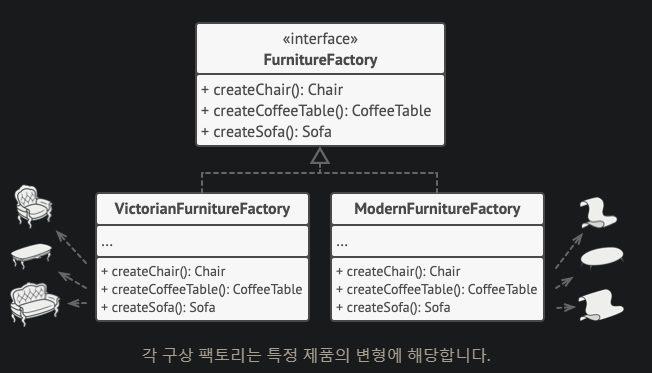
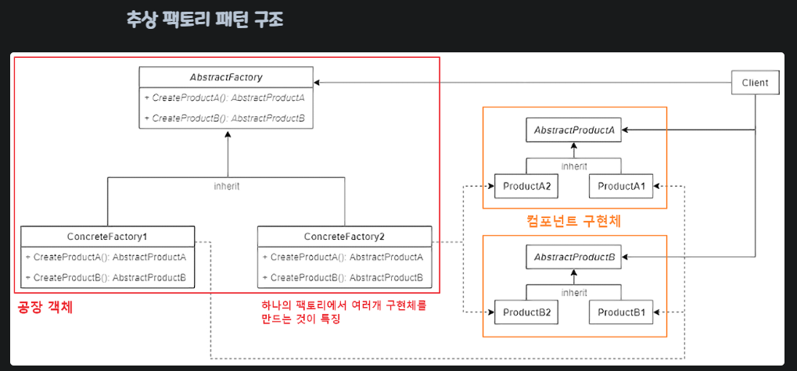

>[!tip] 
>팩토리를 사용하는 방법으로, 서로 연관되거나 의존적인 조합을 만드는 여러종류의 객체 `집합`를 만들기위해 인터페이스를 제공하는 패턴이다.

팩토리 메서드와 비슷한 방식이고 `추상 팩토리 패턴` 을 선언이 되어있고, 개별 제품들의 생성 메서드들이 목록화 되어있는 인터페이스 입니다.

이 때, 클라이언트 코드는 자신에 해당하는 추상 인터페이스를 통해 팩토리들과 제품들 모두와 함께 작동해야 한다
왜냐하면 그래야 클라이언트 코드에 넘기는 팩토리의 종류와 제품 변형들을 `클라이언트 코드를 손상하지 않으며` 자유자재로 변경 할 수 있습니다.

## 적용 시기
1. 추상 팩토리는 코드가 관련된 제품군의 다양한 패밀리들과 작동해야 하지만 해당 제품들의 구상 클래스들에 의존하고 싶지 않을 때 사용을 고려해야 한다. 
   왜냐하면 이러한 클래스들은 당신에게 미리 알려지지 않았을 수 있으며, 그 때문에 향후 확장성​(extensibility)​을 허용하기를 원할 수 있기 때문입니다.
2. 추상 팩토리는 제품 패밀리의 각 클래스에서부터 객체들을 생성할 수 있는 인터페이스를 제공합니다. 위 인터페이스를 통해 코드가 객체들을 생성하는 한  `이미 생성된 제품들과 일치하지 않는 잘못된 제품 변형을 생성하지 않을지 걱정할 필요가 없습니다.

1.  코드에 클래스가 있고, 이 클래스의 [팩토리 메서드들](https://refactoring.guru/ko/design-patterns/factory-method)의 집합의 기본 책임이 뚜렷하지 않을 때 추상 팩토리 구현을 고려해야한다.
2. 잘 설계된 프로그램에서는 _각 클래스는 하나의 책임만 가집니다_. 클래스가 여러 제품 유형을 상대할 경우, 클래스의 팩토리 메서드들을 독립실행형 팩토리 클래스 또는 완전한 추상 팩토리 구현으로 추출할 가치가 있을 수 있습니다.

## 장점
1. 팩토리에서 생성되는 제품들의 상호 호환을 보장할 수 있습니다.
2. _단일 책임 원칙_. 제품 생성 코드를 한 곳으로 추출하여 코드를 더 쉽게 유지보수할 수 있습니다.
3. _개방/폐쇄 원칙_. 기존 클라이언트 코드를 훼손하지 않고 제품의 새로운 변형들을 생성할 수 있습니다.

## 단점
1. 패턴과 함께 새로운 인터페이스들과 클래스들이 많이 도입되기 때문에 코드가 필요 이상으로 복잡해질 수 있습니다.