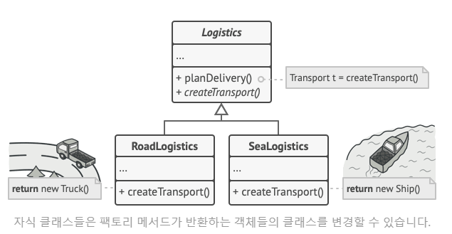

---
### 팩토리 메서드 패턴이란?
>[!info]
**팩토리 메서드**는 부모 클래스에서 객체들을 생성할 수 있는 인터페이스를 제공하지만, 
자식 클래스들이 생성될 객체들의 유형을 변경할 수 있도록 하는 생성 패턴입니다.



![[]]
반환 타입으로 객체를 다르게 생성하는 방식이다.
약간의 제한이 있는데 **자식 클래스들은 다른 유형의 제품들을 해당 제품들이 공통 기초 클래스 또는 공통 인터페이스가 있는 경우에만 반환이 가능하다.**
즉, 공통 인터페이스가 꼭 존재해야 한다는 뜻!
추가로 공통 인터페이스의 팩토리 메서드의 반환 유형을 선언해야 한다.
정리하자면, 
1. 모든 제품들은 같은 인터페이스를 따라야 한다.
2. 공통 인터페이스의 팩토리 메서드의 반환 유형을 선언해야 한다.

>[!tip] 팁!
>팩토리 메서드를 사용하는 코드를 "클라이언트 코드" 라고 부르며, 클라이언트 코드는 다양한 자식 클래스들에서 실제로 반환되는 여러 제품간의 차이에 대해 알지 못한다! 
>즉, 클라이언트는 메서드가 어떻게 정확히 작동하는지 1도 중요하지 않다.

---
## 구조

### 클래스 다이어그램
![[Pasted image 20230922095802.png]] ![[Pasted image 20230922101106.png]]
클래스 다이어그램을 보면 Creator 가 최상위 공장 클래스이고, '팩토리 메서드' 를 추상화 하여 서브 클래스로 구현하도록 합니다.
이 예제에서는, createProduct() 가 팩토리 메서드이고 서브 클래스에서 재정의할 객체 생성 추상 메서드 입니다!

즉, 팩토리 메서드 패턴은 객체를 만드는 공장을 만드는 패턴이다!

#### 장점
1. 결합도가 낮아진다.
2. '단일 책임 원칙' 이 적용되어 유지보수가 용이해진다.
3. '개방 / 폐쇄 원칙' 이 적용되어 기존 클라이언트 코드를 훼손하지 않고 새로운 유형의 제품들을 프로그램에 쉽게 도입 할 수 있다.

#### 단점
1. **각 제품 구현체마다 팩토리 객체들을 모두 구현해주어야 하기 때문에,** 구현체가 늘어날때 마다 팩토리 클래스가 증가하여 서브 클래스 수가 많아진다.

## 예제 코드
![[Pasted image 20230922101154.png]]

```js 
// 제품 객체 추상화 (인터페이스)
interface IProduct {
    void setting();
}

// 제품 구현체
class ConcreteProductA implements IProduct {
    public void setting() {
    }
}

class ConcreteProductB implements IProduct {
    public void setting() {
    }
}
```
``

> [!tip] Title-only callout

[유용한 사이트](https://refactoring.guru/ko/design-patterns/factory-method)
[팩토리 메서드 vs 추상 팩토리 메서드 ](https://inpa.tistory.com/entry/GOF-%F0%9F%92%A0-%ED%8C%A9%ED%86%A0%EB%A6%AC-%EB%A9%94%EC%84%9C%EB%93%9CFactory-Method-%ED%8C%A8%ED%84%B4-%EC%A0%9C%EB%8C%80%EB%A1%9C-%EB%B0%B0%EC%9B%8C%EB%B3%B4%EC%9E%90#factory_method_vs_abstract_factory)
